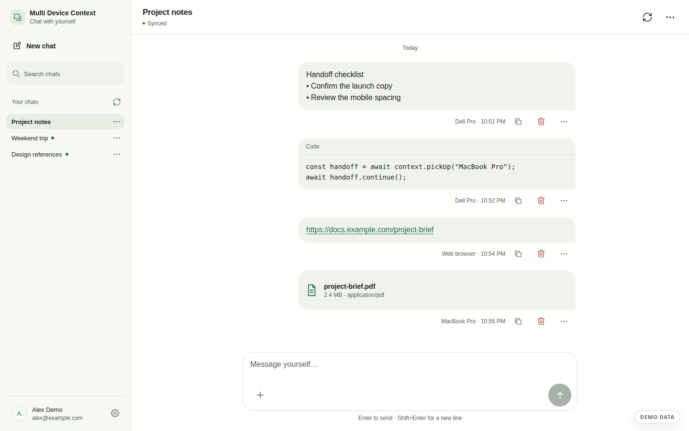
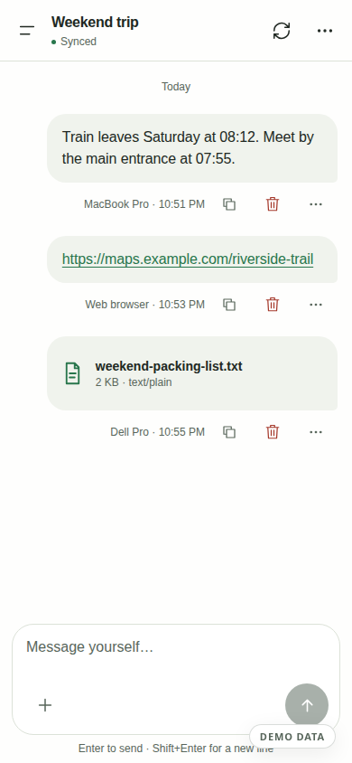
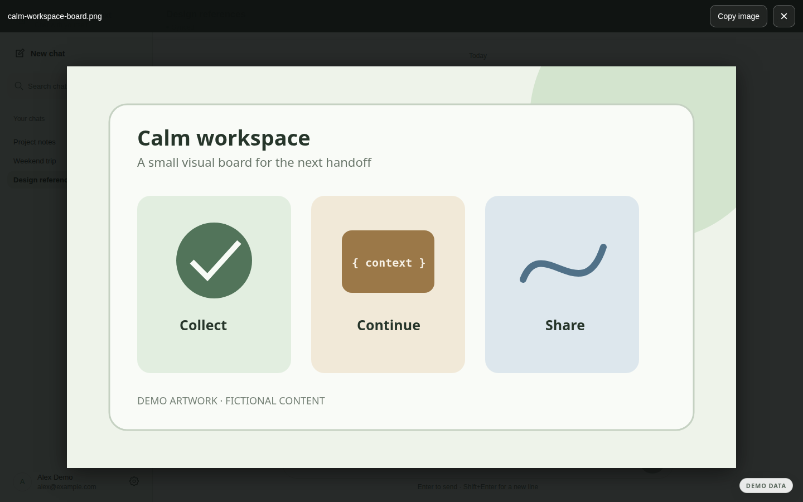
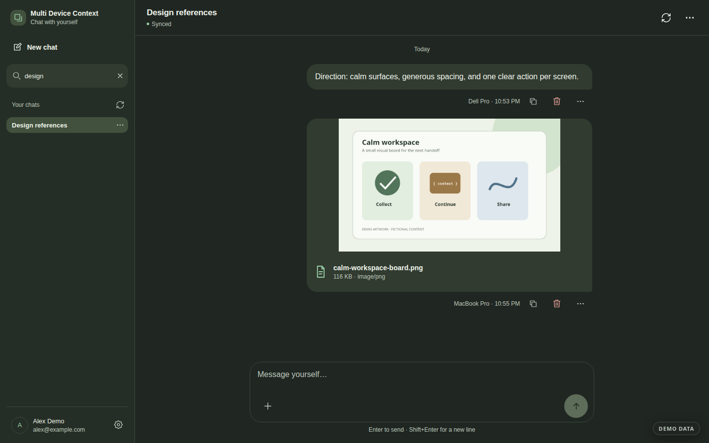

# Multi Device Context

**A private chat with yourself, across your devices — and with the agents you choose.**

Move text, code, links, images, and files between Android, Windows, macOS, and
the web. Start a context on one device, continue it on another, or hand it to an
agent and receive the result in the same conversation.

<p align="center">
  
</p>

> The screenshots in this README are rendered from the real app with a local,
> synthetic fixture. Every account, message, file, device, and illustration is
> fictional demo data.

## Download v0.5.4

| Platform | Direct download | Requirements and signing |
| --- | --- | --- |
| macOS | [Download DMG](https://github.com/pbuchman/multi-device-context/releases/download/v0.5.4/Multi-Device-Context-0.5.4-mac-arm64.dmg) | Apple Silicon, macOS 13+. Ad-hoc signed; not notarized. |
| Windows | [Download EXE](https://github.com/pbuchman/multi-device-context/releases/download/v0.5.4/Multi-Device-Context-0.5.4-win-x64.exe) | Windows x64. Unsigned. |
| Android | [Download APK](https://github.com/pbuchman/multi-device-context/releases/download/v0.5.4/Multi-Device-Context-0.5.4-android-v9-release.apk) | Android 8/API 26+. External APK, privately signed with the existing release key. |

Review the [installation guide](docs/installation.md) before opening an unsigned
or non-notarized desktop build. Android setup and device support are covered in
the [Android guide](docs/android.md). Published checksums are available in
[SHA256SUMS.txt](https://github.com/pbuchman/multi-device-context/releases/download/v0.5.4/SHA256SUMS.txt),
and every asset is listed on the [v0.5.4 release page](https://github.com/pbuchman/multi-device-context/releases/tag/v0.5.4).

Publishing the source and installers does not grant access to the maintainer's
hosted deployment. Hosted access remains subject to its authentication and
device permissions. Run your own deployment with the
[self-hosting guide](docs/self-hosting.md).

## One context, wherever the work continues

The same React interface runs in the web app, Electron desktop clients, and the
Capacitor Android app. Sign in with the same Google account, then explicitly
grant each installation the access it needs. Realtime updates run while a client
is active; drafts and queued shares survive ordinary restarts and reconnect when
the service is available.

<p align="center">
  
</p>

- Send text, code blocks, HTTPS links, screenshots, and files up to 100 MiB.
- Copy or save incoming items only when you choose; receiving content never
  replaces the clipboard automatically.
- Search chats, resize the desktop sidebar, use light or dark themes, and enlarge
  browser-renderable images inside the app.
- Keep working through temporary disconnects with local drafts and an outbox;
  the UI distinguishes pending, offline, incomplete, and synchronized state.
- Permanently delete messages or whole contexts after confirmation. There is no
  application trash or restore.

## Agent handoff

An owner can create a named agent key in Settings, share a context with a local
agent workflow, and let the agent return text, code, or files to that context.
The portable CLI can list and watch contexts, append results, upload or download
attachments, rename contexts, and delete data.

Agent keys have full read, write, and permanent-delete access to their owner's
contexts. Store them outside the repository and revoke them when the handoff is
complete. The [agent API and portable skill guide](docs/agent-api.md) documents
the commands, HTTP contract, retry rules, and key handling.

## Real interface, synthetic showcase

Clicking an image opens the full-window preview used by the product. Chat search
and theme selection are also part of the same interface; the images below are
Playwright captures of those states rather than UI mockups.

<table>
  <tr>
    <td width="50%"></td>
    <td width="50%"></td>
  </tr>
  <tr>
    <td align="center"><sub>Enlarged image preview</sub></td>
    <td align="center"><sub>Dark theme and chat search</sub></td>
  </tr>
</table>

## Privacy and operating model

Contexts and original attachments live in the configured deployment's Firestore
database and private Cloud Storage bucket. The API derives the owner namespace
from verified identity, and installation grants limit which contexts a device
can open. Incoming attachments stream through the authenticated API rather than
public object URLs.

The service is **not end-to-end encrypted**: the deployment operator and its
infrastructure providers process the data. Optional AI-generated titles are off
for new accounts and make no provider request until enabled. Read the complete
[data handling and privacy guide](docs/privacy.md), including local storage,
deletion, AI-title, and agent-key behavior. Device access and passkey-confirmed
grant changes are described in [device access operations](docs/operations/device-access.md).

## Updating

There is no automatic updater yet. To update a desktop client, finish or review
pending shares, quit it from the tray or menu bar, download the newer release,
then install over the existing Windows application or replace the application in
macOS Applications. After updating, reconnect and close older app tabs if the
client requests the one-time local history migration.

For Android, install the newer APK over the existing application. An upgrade must
keep the same application ID and existing signing key and use a higher version
code. Do not uninstall or clear app data to work around an upgrade failure,
because doing so can discard local drafts, pending shares, and the session. See
the [installation](docs/installation.md) and [Android](docs/android.md) guides for
the full update and removal procedures.

## Development

Use Node.js 22.12 or newer, pnpm 10.29.3, and Java 21 for Firebase rules tests.
The local UI fixture uses synthetic data and does not require cloud credentials.

```sh
pnpm install --frozen-lockfile
pnpm test
pnpm typecheck
pnpm build:web
pnpm --filter @mdc/server build
pnpm test:rules
```

Start the fixture with `pnpm --filter @mdc/web dev --port 4173 --strictPort`, then
open `http://127.0.0.1:4173/e2e.html`. The [self-hosting guide](docs/self-hosting.md)
covers production configuration and deployment. Repository automation is visible
on the [GitHub Actions page](https://github.com/pbuchman/multi-device-context/actions):
the checked-in workflows run source, type, web/server, rules, security, desktop,
and Android checks without production secrets.

See the [security policy](SECURITY.md), [release history](CHANGELOG.md), and
[MIT license](LICENSE).
